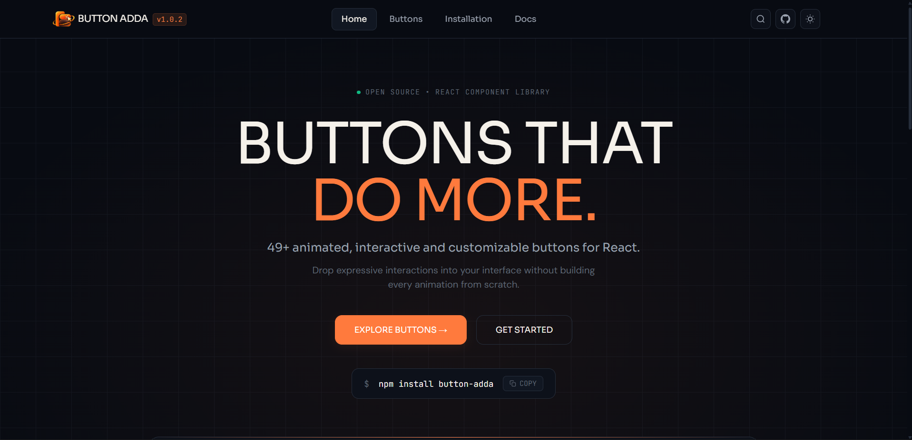

---

<div align="center">


### Expressive, Animated & Interactive Buttons for React

<p>
A collection of 49+ animated, interactive and customizable React buttons
designed to make modern interfaces feel more alive.
</p>


</div>

---

# ✨ What is Button Adda?

Button Adda is made for developers who don't want boring buttons.

From subtle hover interactions to expressive animations, the library provides **49+ ready-to-use React buttons** that can be customized and dropped directly into your projects.

The website acts as the **showcase, explorer, installation guide, and documentation hub** for the library.


---

# 🌐 For Live Preview :-

**[🚀 Click To Open:)](https://button-adda.netlify.app)**


---

# ✨ Features :-

- 🎨 49+ animated and interactive React buttons
- ⚡ Modern and responsive interface
- 🧩 Component explorer
- 📖 Component documentation
- ⚙️ Props and customization details
- 📦 Quick npm installation
- 🌙 Dark / light theme
- 🔍 Button search
- 🚀 Easy-to-follow installation guide
- 💻 Developer-focused UI

---

# 📦 Installation :-

Install ButtonAdda using npm:

```bash
npm install button-adda
```

Or using Yarn:

```bash
yarn add button-adda
```

Or using pnpm:

```bash
pnpm add button-adda
```

---


# 📖 Documentation :-

The ButtonAdda documentation website provides a complete component exploration experience.

Each component can include:

- 🟢 Live Preview
- 🎨 Default State
- 🛠️ Customized State
- 👆 Hover State
- 🚫 Disabled State
- ⚙️ Available Props
- 💻 Usage Example
- 📋 Copyable Code
- 🧩 Component Details

Explore the collection, choose a button and copy the code directly into your React project.

---

# 💻 Development :-

## 0️⃣ Get the Project Code

Clone the repository:

```bash
git clone https://github.com/reejalchoudhary/button-adda.git
```

Move into the project directory:

```bash
cd button-adda
```

### OR Download the ZIP

Go to:

**Code → Download ZIP**

Then:

1. Extract the downloaded ZIP.
2. Open the project folder in your code editor.
3. Install the dependencies.

---

## 1️⃣ Install Dependencies

```bash
npm install
```

---

## 2️⃣ Run the Development Server

```bash
npm run dev
```

The development server will usually be available at:

```text
http://localhost:5173
```

---

## 🛠️ Built With :-

- ⚛️ React
- ⚡ Vite
- 🟨 JavaScript / JSX
- 🎨 CSS


---

# 🤝 Open Source :-

Button Adda is open source and contributions are welcome.

If you have an idea, improvement, bug fix, or new button concept, feel free to contribute.

## Contribution Steps :-

### 1️⃣ Fork the Repository

Fork the ButtonAdda repository on GitHub.

### 2️⃣ Clone Your Fork

```bash
git clone https://github.com/reejalchoudhary/button-adda.git
```

### 3️⃣ Create a New Branch

```bash
git checkout -b feature/amazing-button
```

### 4️⃣ Make Your Changes

Create your component or improve an existing part of the project.

### 5️⃣ Commit Your Changes

```bash
git add .
git commit -m "Add amazing button component"
```

### 6️⃣ Push Your Branch

```bash
git push origin feature/amazing-button
```

### 7️⃣ Open a Pull Request

Open a Pull Request and describe your changes.

---

## 🔗 Links

- **🌐 Website:** [Button Adda](https://button-adda.netlify.app)
- **📦 NPM Package:** [button-adda](https://www.npmjs.com/package/button-adda)
- **💻 GitHub:** [Button Adda](https://github.com/reejalchoudhary/button-adda)

---

# 📄 License :-

ButtonAdda is licensed under the MIT License.

See the [LICENSE](LICENSE) file for details.

---

# 📲 Follow Me :-

<p align="left">

<a href="https://dev.to/reejalchoudhary" target="_blank">

</a>

<a href="https://twitter.com/choudharyreejal" target="_blank">

</a>

<a href="http://www.linkedin.com/in/reejal-choudhary-532386237" target="_blank">

</a>

<a href="https://stackoverflow.com/users/reejalchoudhary" target="_blank">

</a>

<a href="https://instagram.com/reejalhere" target="_blank">

</a>

<a href="https://www.behance.net/reejalchoudhary" target="_blank">

</a>

</p>

---

# 📡 Contact Me :-

- Email📧: reejalree@gmail.com
- Mobile📞: 7018361108
---

<div align="center">

#  BUTTON ADDA

### Buttons that do more.

**49+ Animated, Interactive & Customizable Buttons for React.**

Made with ❤️ and lots of animations.

### ⭐ If you like ButtonAdda, don't forget to star the repository!

</div>

